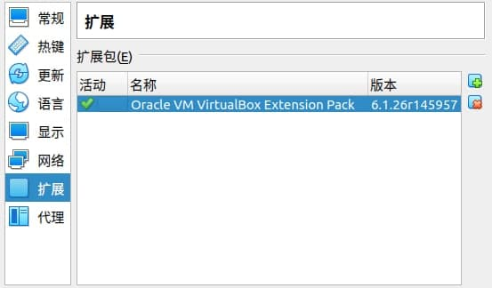
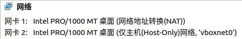
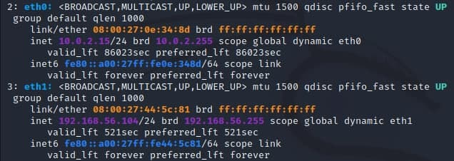
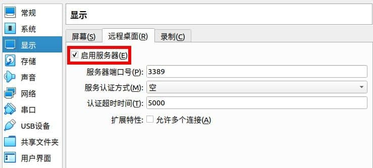
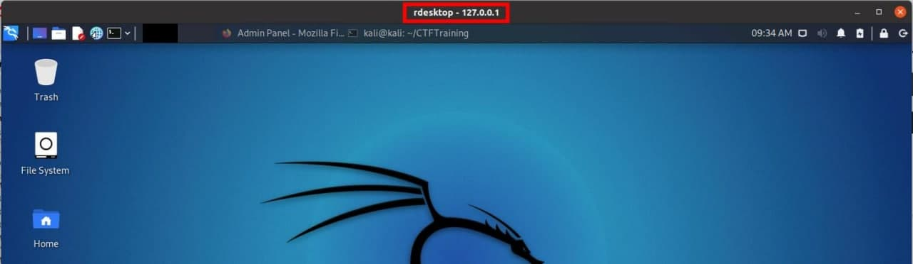

# 课程基础环境搭建与配置

## 基本任务

- [x] Virtualbox 已安装并配置好 Extension Pack
- [x] 安装好最新版 Kali 系统
- [x] pip3 已安装
- [x] docker 已安装
- [x] docker-compose 已安装
- [x] 已了解 Virtualbox 网络连通性配置方法
- [x] 虚拟机的 SSH 服务开机自启动
- [x] 虚拟机的 SSH 免密登录

## 实验环境

- 宿主机： Ubuntu 20.04
- 虚拟机
  - Kali 2021.2
  - 使用官网最新 OVA 导入安装

## 安装 Virtualbox Extension Pack

```bash
sudo apt install virtualbox-ext-pack
```
安装完成后，可能需要等待一段时间才能在 Virtualbox 中看到



## Kali 设置双网卡

- 虚拟机网卡设置<br>

- 编辑 `/etc/network/interfaces`，添加
  ```bash
  # NAT
  auto eth0
  iface eth0 inet dhcp

  # Host-Only
  auto eth1
  iface eth1 inet dhcp
  ```
- 重启服务即可生效：`sudo systemctl restart networking.service`<br>


## 安装增强功能

```bash
sudo apt update
sudo apt install -y --reinstall virtualbox-guest-x11
reboot
```

## VirtualBox 远程桌面

- 启用服务：设置 -> 显示 -> 远程桌面<br>

- 启动虚拟机时可通过 `▾` 选择「无界面启动」

### 使用 `rdesktop` 连接虚拟机

```bash
rdesktop -a 16 -N 127.0.0.1:3389
```



## 其他

- 使用 `systemctl` 代替过时的 `service`

## 参考资料

- [VirtualBox Extension Pack installation on Ubuntu 20.04 Focal Fossa Linux](https://linuxconfig.org/virtualbox-extension-pack-installation-on-ubuntu-20-04-focal-fossa-linux)
- [[Kali Linux] How to enable Two Network Interface simultaneously in VirtualBox](https://www.youtube.com/watch?v=ifNuXsZPBfo)
- [Installing VirtualBox Guest Addition (Guest Tools)](https://www.kali.org/docs/virtualization/install-virtualbox-guest-additions/)
- [Chapter 7. Remote Virtual Machines](https://www.virtualbox.org/manual/ch07.html)