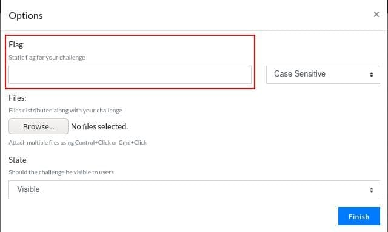

# CTFd 安装与配置

## 基本任务

- [x] 本地搭建的 CTFd 系统已可访问
- [x] 支持导入并运行 https://github.com/CTFTraining/CTFTraining 中的动态 docker 环境题目

## 本地搭建的 CTFd 系统已可访问

- 克隆自 Gitee 的仓库目录需要重命名为 `CTFd`
- 添加当前用户到 `docker` 组：`sudo usermod -aG docker <username>`，设置完成后重新登录即生效

### 容器构建与启动

- 修改 `docker-compose.yml` 中 `subdomain_host` 的值为 `actf.cuc.edu.cn` 避免和线上环境冲突
  - 修改替换 `conf/nginx/http.conf` 中 `ctf.cuc.edu.cn` 为 subdomain_host 的值
  - 可能遇到报错 `ModuleNotFoundError: No module named 'flask_apscheduler'` 导致容器无法正常启动，将依赖添加到 `requirements.txt` 中，再次 `docker-compose build`
    ```bash
    flask-apscheduler==1.12.2
    ```

### 配置泛域名解析

- 泛域名解析使得所有次级域名 `*.actf.cuc.edu.cn` 指向同一 IP 地址
- `/etc/dnsmasq.conf` 文件末尾追加
  ```bash
  strict-order
  no-hosts
  cache-size=32768
  listen-address=127.0.0.1
  address=/actf.cuc.edu.cn/127.0.0.1
  ```
- `/etc/resolv.conf` 文件头添加
  ```bash
  nameserver 127.0.0.1
  ```

### 基本设置

- 访问 http://actf.cuc.edu.cn/setup 完成初次访问设置后，即可访问 `Admin Panel`<br>

- 访问 `Admin Panel`，修改 `Whale` 中 `Frp` 的设置，完成后 `Submit`
  ```bash
  # API URL
  # 需与 docker-compose.yml 中的设置一致
  http://<change_this_as_you_will>:<change_this_to_random_psw>@frpc:7400

  # Http Domain Suffix
  actf.cuc.edu.cn
  ```

## 动态 Docker 环境题目

- 在 `Admin Panel` 的 `Challenges` 中新建题目，选择题目类型为 `dynamic_docker`
- 使用 [CTFTraining/CTFTraining](https://github.com/CTFTraining/CTFTraining) 中的题目镜像，并设置题目分值<br>

- 选项设置中 Flag 留空（启动容器时将动态生成），状态设置为 `Visible`<br>

- 前往 `Challenges` 界面，启动题目容器<br>

- 待容器初始化完成后，可以访问题目网站<br>


## 参考资料

- [cuc-ctfd - TL;DR](https://e.gitee.com/cuc-ccs/repos/cuc-ccs/cuc-ctfd/blob/gitee-master/TLDR.md)
- [Getting Started | CTFd](https://docs.ctfd.io/tutorials/getting-started/)