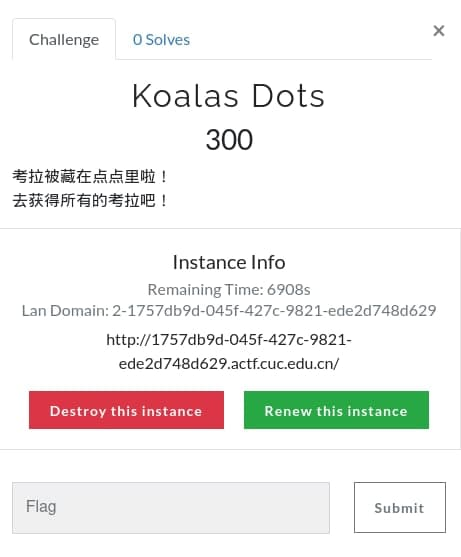
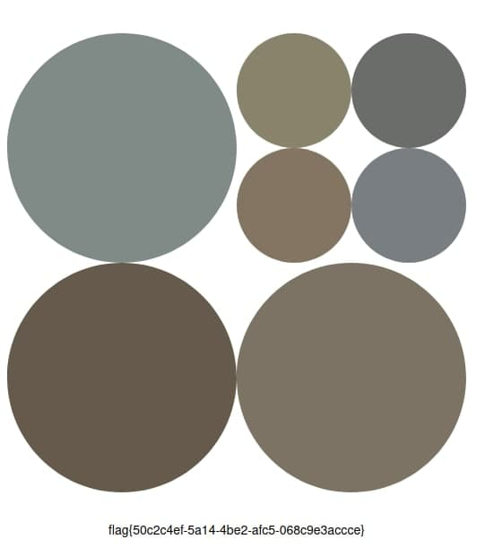

# CTF MISC 解题与出题

## 简介

- Misc（杂项，Miscellaneous）
- 常见题目类型：信息搜集（Recon）、编码转换（Encode）、数字取证 && 隐写分析（Forensic && Stego）
- Misc 考察基本知识，对安全技能的各个层面都有不同程度的涉及

## 信息搜集

- 纯信息搜集题目在新手向比赛的出场频率很高 ( ´∀` )
- 信息搜集是所有题目的基础，快速入门的最佳选择

### 技巧

- **科学上网**
- 地图和街景搜索
  - [Google Map](https://www.google.com/maps)、百度地图

#### Google Hacking

- 利用 Google 搜索引擎中的高级操作符高效过滤搜索结果

    操作符 | 作用 | 示例
    -|-|-
    site|搜索指定网站|site:wikipedia.org
    filetype|在指定文件类型中搜索|filetype:pdf
    intitle|搜索页面标题|intitle:wikipedia
    inurl|搜索 URL|inurl:wikipedia
    intext|搜索页面文本|intext:wiki
    ""|搜索词精确匹配|"Wikipedia"
    -|过滤指定词|jaguar speed -car

- [高级搜索 GUI](https://www.google.co.in/advanced_search)
- [Google Hacking Database](https://www.exploit-db.com/google-hacking-database)

### 例题

- Hackergame2020 - 猫咪问答++

#### HSCTF 8 - geographic-mapping

- 找到地点对应的经纬度
- 可以从标志物入手


## 编码转换

- 通常与其他类型题目结合

### 常见编码

- 摩斯编码：`-... -.-`
- ASCII 码、二进制编码、十六进制编码
- Base64：大小写字母各 26 个、10 个数字、`+`、`/`，`=` 作为填充字符
- ROT13：简易单表代换，$ C \equiv (M+13) \ mod \ 26 $
- 条形码、二维码
- 在线工具
  - [CyberChef](https://gchq.github.io/CyberChef/)
  - [Modular conversion, encoding and encryption online — Cryptii](https://cryptii.com/)

### 例题

- [Stegano50](challenges/stegano50.pdf)
  - 透明颜色达到视觉隐藏的目的

## 数字取证 && 隐写分析

- 任何要求检查一个静态数据文件从而获取隐藏信息的都可以被认为是隐写取证题
- 了解常见文件的文件头和文件尾，隐藏信息可能出现在文件尾之后或修复错误的文件头

### 常用工具

- [010 Editor](https://www.sweetscape.com/010editor/)
  - 十六进制文件编辑器
  - 提供常见文件类型模板解析
- Wireshark
- 命令行工具
  - `file`：根据文件头判断文件类型
  - `exiftool`：查看文件详细信息
  - `strings`：打印文件中的可打印字符
  - `binwalk`：根据文件头识别一个文件中是否夹杂其他文件
    - `binwalk -e` 自动化提取，或使用 `dd` 命令手动切割

### 例题

#### 图片分析

- 针对不同格式的图片，分析方向有一定差异
- CSICTF2020 - Gradient sky<br>


#### 音频隐写

- 包括 MP3 隐写、LSB 隐写、波形隐写、频谱隐写等
- 遇到音频文件通常不会用播放器打开 👀
- SUCTFQUALS2014 - [Hear-with-your-Eyes](challenges/hear-with-your-eyes.wav)

#### 流量包分析

- 通常提供一个包含流量数据的 PCAP 文件，可能会需要先修复或重构传输文件后再分析
- 可以概括为三个方向：流量包修复、协议分析、数据提取
- NEWSCTF2021 - [！了反都，了反](challenges/piz.galf)

#### 压缩包分析

- 常见压缩包格式：ZIP / RAR
- 密码爆破工具
  - Windows：[ARCHPR](http://www.downcc.com/soft/130539.html)
  - 命令行：`fcrackzip`、`rarcrack`
    ```bash
    fcrackzip -b -c 1 -u test.zip
    # -b 指定模式为爆破
    # -c 1 指定密码类型为纯数字
    # -u 使用 unzip 过滤错误密码
    ```
- 伪加密：`binwalk -e` / 7-Zip 无视伪加密
- 赛客夏令营2017 - 机密信息<br>


## 原创题目

### MISC - Koalas Dots

- 灵感来源：[vogievetsky/KoalasToTheMax](https://github.com/vogievetsky/KoalasToTheMax)
- 容器地址：[yanhui22/koalas-dots](https://hub.docker.com/repository/docker/yanhui22/koalas-dots)
- 防绕过措施 🤐
  - 每个点达到最小直径时，从服务器获取该点对应的随机值
    - 优化：每个点达到**第二**小直径时，从服务器获取该点分裂后其中一个子点的随机值，其它子点继承该值
  - 当所有点都达到最小直径时，需要向服务器确认各个点的随机值，以解锁下一张图
  - CSRF token
- 防手工解题 🤗
  - session 生命周期 30 分钟





#### 遇到问题与解决

- 点未完成分裂就提交请求到后端，导致坐标为浮点数
  - JS 异步，先执行分裂相关的前端代码
    ```js
    SetsetTimeout( () => {提交请求相关函数}, 1000);
    ```
- Flag 为空
  - `entrypoint.sh` 在每次启动容器时运行，放置替换 Flag 的相关命令

#### 参考资料

- [tiangolo/uwsgi-nginx-flask-docker](https://github.com/tiangolo/uwsgi-nginx-flask-docker)
- [Flask-Session](https://flask-session.readthedocs.io/en/latest/)
- [CSRF Protection — Flask-WTF Documentation (0.15.x)](https://flask-wtf.readthedocs.io/en/0.15.x/csrf/)
- [如何正确使用Docker出一道CTF题目](https://www.v0n.top/2020/05/01/%E5%A6%82%E4%BD%95%E6%AD%A3%E7%A1%AE%E4%BD%BF%E7%94%A8Docker%E5%87%BA%E4%B8%80%E9%81%93CTF%E9%A2%98%E7%9B%AE/)
- [Deploying Challenges | CTFd](https://docs.ctfd.io/tutorials/deploying-challenges/)

## 参考资料

- [杂项简介 - CTF Wiki](https://ctf-wiki.org/misc/introduction/)
- [Google hacking - Wikipedia](https://en.wikipedia.org/wiki/Google_hacking)