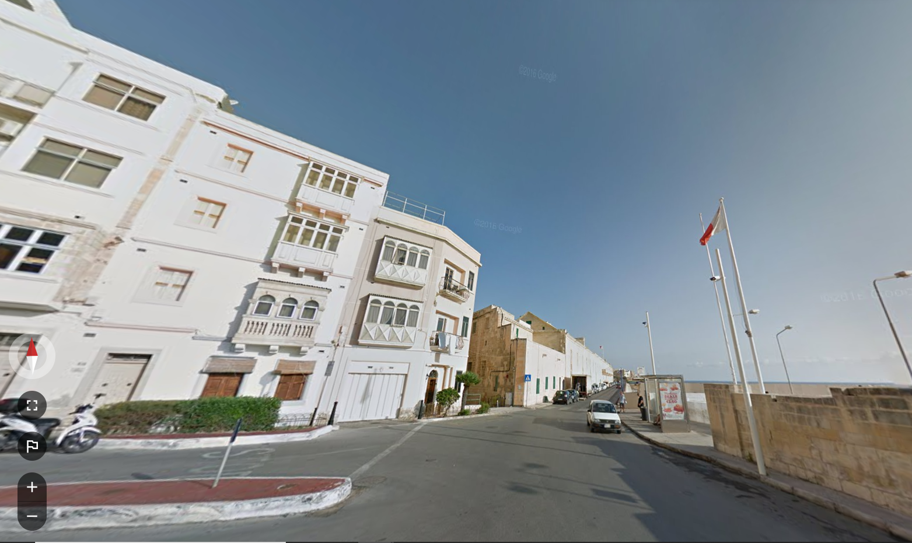

# CTF MISC 解题与出题

## 简介

- Misc（杂项，Miscellaneous）
- 常见题目类型：信息搜集（Recon）、编码转换（Encode）、数字取证 && 隐写分析（Forensic && Stego）
- Misc 考察基本知识，对安全技能的各个层面都有不同程度的涉及

## 信息搜集

- 纯信息搜集题目在新手向比赛的出场频率很高 ( ´∀` )
- 信息搜集能力是所有题目的基础，快速入门的最佳选择

### 技巧

- **科学上网**
- 地图和街景搜索
  - [Google Map](https://www.google.com/maps)、百度地图

#### Google Hacking

- 利用 Google 搜索引擎中的高级操作符高效过滤搜索结果

    操作符 | 作用 | 示例
    -|-|-
    site|搜索指定网站|site:wikipedia.org
    filetype|在指定文件类型中搜索|filetype:pdf
    intitle|搜索页面标题|intitle:wikipedia
    inurl|搜索 URL|inurl:wikipedia
    intext|搜索页面文本|intext:wiki
    ""|搜索词精确匹配|"Wikipedia"
    -|过滤指定词|jaguar speed -car

- [高级搜索 GUI](https://www.google.co.in/advanced_search)
- [Google Hacking Database](https://www.exploit-db.com/google-hacking-database)

### 例题

- Hackergame2020 - 猫咪问答++

#### HSCTF 8 - geographic-mapping

- 找到地点对应的经纬度
- 可以从标志物入手

